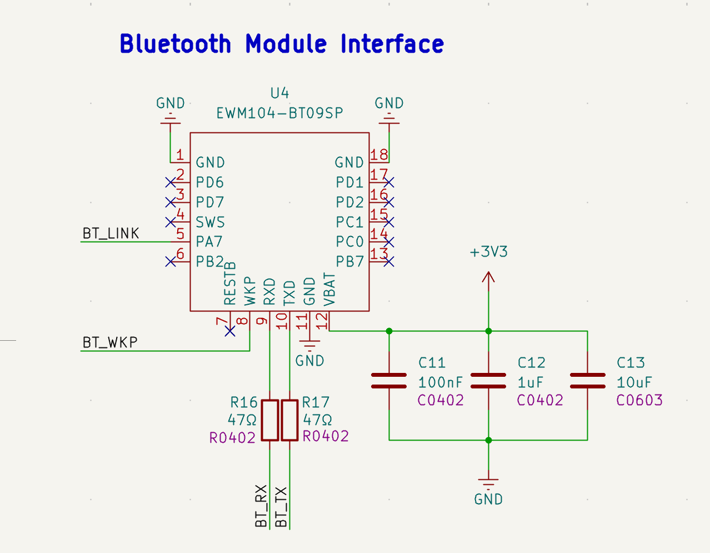
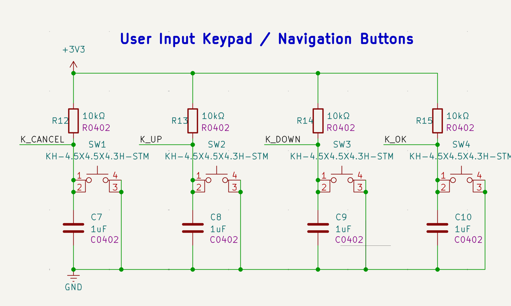
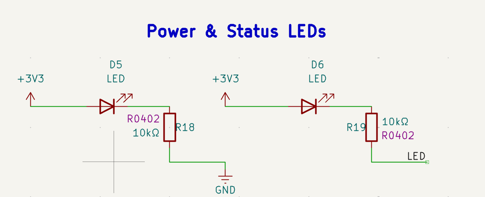
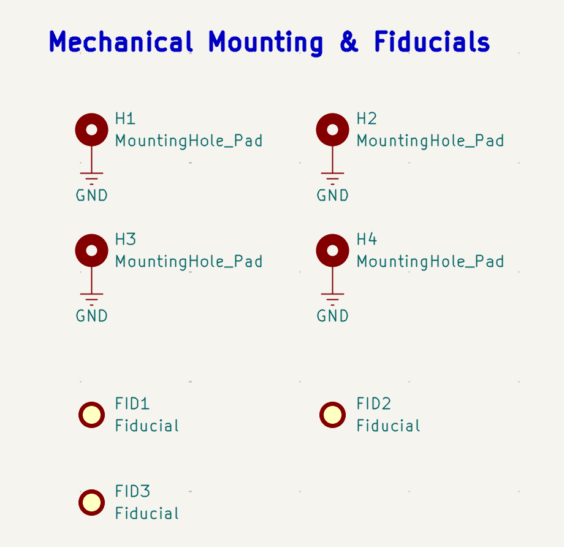

# Building an Open Hardware Wallet – Step 3: Bluetooth, User Input, Status LEDs & Mechanical Basics

**一步一步做开源硬件钱包 — 第三步：蓝牙模块、用户输入、状态指示灯与机械基础**

## Introduction / 介绍

After finishing the power layer, battery charging, voltage monitoring, and external SPI Flash, the next step is to make the device more interactive and closer to a real standalone hardware wallet.

A hardware wallet is not only a signing circuit.

It also needs communication, user confirmation, status feedback, and mechanical references for real-world assembly.

完成电源层、锂电池充电、电池电压监测和外部 SPI Flash 之后，下一步是让设备具备更完整的交互能力，并逐步接近一个真正可以独立工作的硬件钱包。

硬件钱包不只是一个签名电路。

它还需要通信接口、用户确认、状态反馈，以及面向真实装配的机械基准。

This is the third stage of the Open Hardware Wallet Lab.

这是 Open Hardware Wallet Lab 的第三阶段。

## Current Progress / 当前进展

In this stage, we add four basic hardware blocks:

- Bluetooth UART module interface
- User input keypad / navigation buttons
- Power and status indicator LEDs
- Mechanical mounting holes and fiducials

本阶段增加四个基础硬件模块：

- 蓝牙 UART 模块接口
- 用户输入按键 / 导航按键
- 电源与状态指示灯
- 安装孔与贴片定位 Mark 点

These blocks do not handle private keys directly, but they are important for turning a circuit board into a usable device.

这些模块并不直接处理私钥，但它们对于把一块电路板变成一个可以使用的设备非常重要。


## Figure 1 / 图 1

**Bluetooth UART Module Interface**



This module adds a Bluetooth module interface based on the `EWM104-BT09SP` module.

The interface exposes basic Bluetooth control and communication signals, including link status, wake-up control, UART receive, and UART transmit.

该模块增加了基于 `EWM104-BT09SP` 的蓝牙模块接口。

接口暴露了基础的蓝牙控制与通信信号，包括连接状态、唤醒控制、UART 接收和 UART 发送。

Main signals in this block:

```text
BT_LINK   Bluetooth link status
BT_WKP    Bluetooth wake-up control
BT_RX     UART receive signal
BT_TX     UART transmit signal
+3V3      Module power supply
GND       System ground
```

本模块主要信号：

```text
BT_LINK   蓝牙连接状态
BT_WKP    蓝牙唤醒控制
BT_RX     UART 接收信号
BT_TX     UART 发送信号
+3V3      模块供电
GND       系统地
```

Small series resistors are added on the UART lines to improve signal integrity and reduce edge noise.

UART 信号线上加入了小阻值串联电阻，用于改善信号完整性并降低边沿噪声。

Local decoupling capacitors are placed near the module power rail to stabilize the 3.3V supply.

模块电源附近放置了本地去耦电容，用于稳定 3.3V 供电。

## Figure 2 / 图 2

**User Input Keypad / Navigation Buttons**



This module adds four user input buttons:

```text
K_CANCEL
K_UP
K_DOWN
K_OK
```

该模块增加四个用户输入按键：

```text
K_CANCEL
K_UP
K_DOWN
K_OK
```

These buttons can later be used for menu navigation, transaction review, confirmation, and cancellation.

这些按键后续可以用于菜单导航、交易查看、用户确认和取消操作。

Each button uses a pull-up resistor to 3.3V and pulls the signal to ground when pressed.

每个按键通过上拉电阻连接到 3.3V，按下时将信号拉到 GND。

A small capacitor is added for basic hardware debounce and noise filtering.

每个按键信号旁边加入小电容，用于基础硬件消抖和噪声滤波。

Main signals in this block:

```text
K_CANCEL  Cancel button input
K_UP      Up navigation input
K_DOWN    Down navigation input
K_OK      Confirm / OK button input
+3V3      Pull-up rail
GND       Button reference ground
```

本模块主要信号：

```text
K_CANCEL  取消按键输入
K_UP      上导航输入
K_DOWN    下导航输入
K_OK      确认 / OK 按键输入
+3V3      上拉电源
GND       按键参考地
```

For a hardware wallet, physical confirmation is important because it creates a user-controlled boundary before sensitive actions are approved.

对于硬件钱包来说，物理确认非常重要，因为它在敏感操作被批准之前，提供了一个由用户控制的边界。

## Figure 3 / 图 3

**Power & Status LEDs**



This module adds simple LED indicators.

One LED can be used as a power indicator, while the other can be controlled by firmware as a status or user LED.

该模块增加了简单的 LED 指示灯。

其中一个 LED 可以作为电源指示灯，另一个可以由固件控制，作为状态灯或用户指示灯。

Main signals in this block:

```text
LED_PWR     Power indicator LED
LED_STATUS  Firmware-controlled status LED
+3V3        LED power rail
GND         System ground
```

本模块主要信号：

```text
LED_PWR     电源指示灯
LED_STATUS  固件控制状态灯
+3V3        LED 电源
GND         系统地
```

Status indicators are simple, but they are useful during bring-up, debugging, charging, boot status, and future user interaction.

状态指示灯很简单，但在硬件 bring-up、调试、充电状态、启动状态和未来用户交互中都很有用。

## Figure 4 / 图 4

**Mechanical Mounting & Fiducials**



This module adds mechanical mounting holes and fiducial marks.

The mounting holes provide mechanical references for enclosure alignment and PCB fixation.

Fiducials provide visual alignment points for SMT assembly and manufacturing.

该模块增加了安装孔和贴片定位 Mark 点。

安装孔为外壳对齐和 PCB 固定提供机械基准。

Fiducial Mark 点为 SMT 贴片和生产制造提供视觉定位基准。

Main mechanical elements in this block:

```text
H1-H4     Mounting holes
FID1-FID3 Fiducial marks
GND       Ground-connected mounting pads
```

本模块主要机械元素：

```text
H1-H4     安装孔
FID1-FID3 贴片定位 Mark 点
GND       接地安装焊盘
```

These parts do not affect the digital logic directly, but they are important for turning the schematic into a board that can be assembled, tested, and eventually placed inside an enclosure.

这些部分不会直接影响数字逻辑，但它们对于把原理图变成可以装配、测试，并最终放进外壳里的 PCB 非常重要。

## Key Takeaways / 本阶段关键点

- A hardware wallet needs communication, not only signing logic.
- Bluetooth UART provides a simple device-side communication interface.
- Physical buttons create a user confirmation path.
- LEDs provide visible power and status feedback.
- Mounting holes and fiducials prepare the design for real PCB assembly and enclosure alignment.
- This stage starts moving the project from circuit blocks toward a usable device.

- 硬件钱包不只需要签名逻辑，也需要通信能力。
- 蓝牙 UART 提供了简单的设备侧通信接口。
- 物理按键建立了用户确认路径。
- LED 提供可见的电源和状态反馈。
- 安装孔和 Mark 点让设计开始面向真实 PCB 装配和外壳对齐。
- 本阶段开始让项目从电路模块走向一个可使用的设备。

## Current Hardware Stage / 当前硬件阶段

```text
Stage 1: USB-C Power Input & 3.3V LDO Regulation
Status: Draft completed

Stage 2: Battery Charging, Voltage Monitoring & External SPI Flash
Status: Draft completed

Stage 3: Bluetooth, User Input, Status LEDs & Mechanical Basics
Status: Work in progress
```

```text
第一阶段：USB-C 电源输入与 3.3V LDO 稳压
状态：草图完成

第二阶段：锂电池充电、电池电压监测与外部 SPI Flash
状态：草图完成

第三阶段：蓝牙模块、用户输入、状态指示灯与机械基础
状态：进行中
```

## Next Steps / 下一步计划

The design is still a work in progress. Next hardware stages may include:

- MCU minimum system
- Reset and boot configuration
- Secure element interface
- Display interface
- USB data interface
- Full PCB layout
- Enclosure alignment
- Firmware bring-up

设计仍在进行中。下一阶段可能包括：

- MCU 最小系统
- 复位与启动配置
- 安全芯片接口
- 显示屏接口
- USB 数据接口
- PCB 完整布局
- 外壳对齐
- 固件 bring-up

## Repository Structure / 仓库结构

```text
docs/        Design notes and learning documents
hardware/    Schematics, PCB files, BOM, and Gerbers
firmware/    Firmware source code and drivers
enclosure/   3D enclosure files
tools/       Helper scripts and transaction tools
images/      Prototype and assembly images
```

## Safety Notice / 安全提示

This project is for learning, research, and open hardware exploration only.

Do not use the current design to store real assets.

Do not treat the current schematic, firmware, or enclosure files as production-ready security hardware.

Security hardware requires careful review, testing, manufacturing control, firmware validation, and threat modeling before it can be used in real environments.

该项目仅用于学习、研究及开源硬件探索。

不要使用当前设计存储真实资产。

当前原理图、固件或外壳文件不能视为可直接使用的安全硬件。

真正的安全硬件需要严格的审查、测试、生产控制、固件验证和威胁建模，才能投入真实环境使用。

## Project Repository / 项目仓库

The project repository is available here:

https://github.com/HavenlonLabs/open-hardware-wallet-lab

The repository will be updated step by step as the schematic, PCB, firmware, enclosure, and documentation evolve.

项目仓库地址：

https://github.com/HavenlonLabs/open-hardware-wallet-lab

后续原理图、PCB、固件、外壳和文档都会随着项目推进逐步更新。